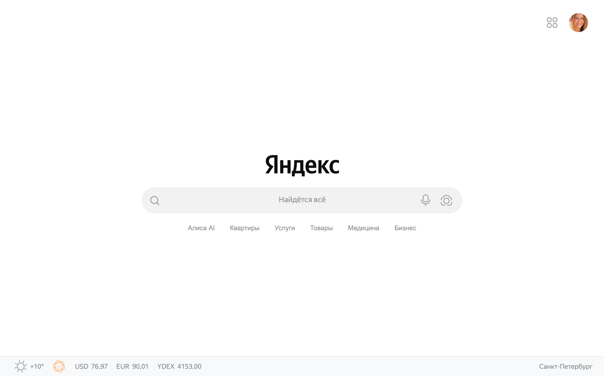

# Ya Beautify

Расширение для Chrome, которое убирает всё лишнее с главной страницы Яндекса и оставляет только поиск.

## Что делает

- Убирает новостную ленту и рекламные блоки
- Скрывает лишние элементы шапки
- Центрирует форму поиска
- Показывает погоду и курсы валют в футере
- Поддерживает светлую и тёмную тему автоматически

## Установка

[Установить из Chrome Web Store](https://chromewebstore.google.com/detail/ya-beautify)

Или вручную:
1. Скачай репозиторий
2. Открой `chrome://extensions`
3. Включи **Режим разработчика**
4. Нажми **Загрузить распакованное** и выбери папку проекта

## Файлы

| Файл | Назначение |
|------|-----------|
| `manifest.json` | Манифест расширения (MV3) |
| `content.css` | Стили, применяемые к странице |
| `content.js` | Скрипт: скрытие элементов, инжект логотипа и сервисов |
| `logo.svg` | Логотип Яндекса (локальная копия) |

## Совместимость

Работает на `ya.ru` и `yandex.ru`. Страница поиска (`/search/`) не затрагивается.

---

Не аффилировано с Яндексом.
